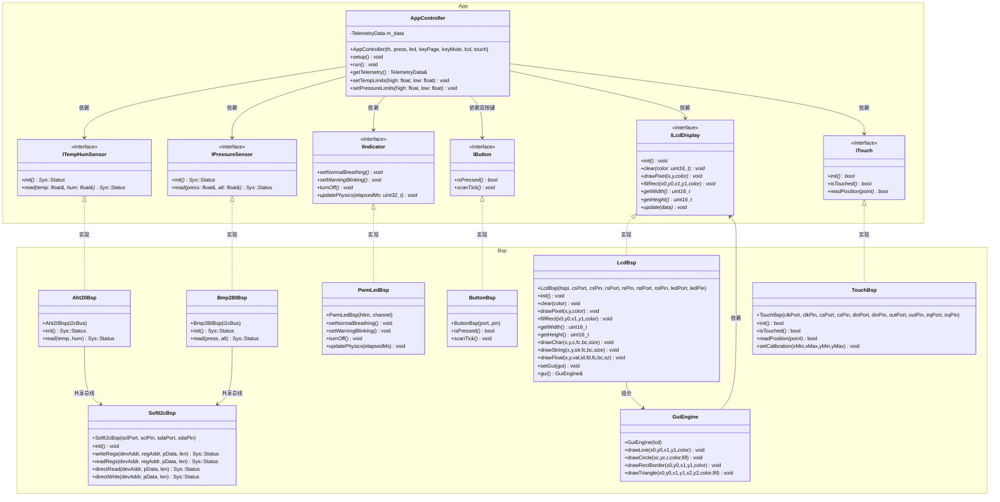

# STM32 C++ 项目 API 接口与类参考手册 (MicroCPProjectSTM32)

本手册详细记录了 `MicroCPProjectSTM32` 固件库的全部核心 C++ API、抽象接口（抽象基类）、板级支持包（BSP）具体实现类以及底层系统宏定义与全局命名空间。

本架构基于 **控制反转（IoC）** 与 **依赖注入（DI）** 设计思想，应用逻辑层（`App`）仅依赖于抽象接口，而具体的底层硬件实现（`Bsp`）则在系统启动时通过构造函数注入至应用层中，从而实现软硬件的完全解耦。

---

## 📐 1. 整体架构与类图

以下是整个系统中应用层控制器、抽象接口、BSP 驱动实现类之间的依赖与继承关系：



---

## ⚙️ 2. 全局系统配置 `SYSTEM` (`sys.hpp`)

统一管理系统的基础配置、调试输出、公共错误代码、运行状态以及高优先级临界区控制。

### 2.1 核心宏定义
| 宏名称 | 默认值 | 作用说明 |
| :--- | :--- | :--- |
| `SYS_CPU_FREQ_HZ` | `72000000U` | 主控 CPU 运行主频 (72 MHz)，用于定时器与总线粗略延时计算。 |
| `SYS_MAIN_LOOP_PERIOD_MS` | `100U` | 主循环心跳周期 (100 ms)，对应主控制器以 10Hz 的频率轮询。 |
| `SYS_I2C_ADDR_AHT20` | `0x38U` | AHT20 温湿度传感器的 7 位物理 I2C 设备地址。 |
| `SYS_I2C_ADDR_BMP280` | `0x76U` | BMP280 气压传感器的 7 位物理 I2C 设备地址（SDO接地）。 |
| `SYS_DEBUG_ENABLED` | `1` | 调试日志输出总开关。若设为 `1`，则通过串口重映射启用 `printf` 输出；为 `0` 则彻底优化为空操作。 |

*   **调试日志宏**：
    ```cpp
    #define SYS_LOG(format, ...) printf("[SYS LOG] " format "\r\n", ##__VA_ARGS__)
    ```
    用于在各模块中格式化输出带前缀的系统级调试日志。

### 2.2 全局通用枚举 (`Sys` 命名空间)

#### `Sys::Status`
表征底层通信、驱动自检以及传感器采样的运行状态结果。
```cpp
enum class Status : uint8_t {
    OK = 0,             // 操作成功
    ERROR_INIT,         // 初始化或自检失败
    ERROR_TIMEOUT,      // 通信或响应超时
    ERROR_BUSY,         // 设备忙碌中
    ERROR_COM_FAIL,     // 物理通信故障（如无ACK应答）
    ERROR_CRC           // 数据校验错误
};
```

#### `Sys::AlarmState`
表征当前环境健康指标的报警状态等级。
```cpp
enum class AlarmState : uint8_t {
    NORMAL = 0,         // 环境指标完全正常
    WARNING_TEMP,       // 温度超限报警状态
    WARNING_PRES,       // 气压超限报警状态
    MUTED               // 报警被用户按下静音键消音状态
};
```

### 2.3 临界区锁函数 (`Sys` 命名空间)
用于保护临界区数据避免多任务或中断引起的数据分裂。
*   `inline void EnterCritical()`: 执行汇编指令 `cpsid i` 关闭系统全局中断。
*   `inline void ExitCritical()`: 执行汇编指令 `cpsie i` 开启系统全局中断。

---

## 📐 3. 应用层抽象接口 (`App` 命名空间)

这组纯虚接口（抽象类）由应用逻辑层调用，板级支持包（BSP）进行具体实现。

### 3.1 温湿度传感器接口 `ITempHumSensor`
*   **头文件**：`App/Inc/ITempHumSensor.hpp`
*   **方法列表**：
    *   `virtual Sys::Status init() = 0;`
        *   **功能**：初始化传感器引脚、总线或检测内部出厂标定状态。
        *   **返回值**：初始化成功返回 `Sys::Status::OK`，否则返回相应错误码。
    *   `virtual Sys::Status read(float& temperature, float& humidity) = 0;`
        *   **功能**：触发并获取最新物理测量值。
        *   **参数**：
            *   `temperature` (出参)：读取的温度值，单位：摄氏度（℃）。
            *   `humidity` (出参)：读取的相对湿度百分比，单位：%。
        *   **返回值**：成功返回 `Sys::Status::OK`。

### 3.2 气压传感器接口 `IPressureSensor`
*   **头文件**：`App/Inc/IPressureSensor.hpp`
*   **方法列表**：
    *   `virtual Sys::Status init() = 0;`
        *   **功能**：初始化气压传感器，加载内部出厂校准寄存器参数。
        *   **返回值**：成功返回 `Sys::Status::OK`。
    *   `virtual Sys::Status read(float& pressure, float& altitude) = 0;`
        *   **功能**：获取最新的物理大气压强值并估算海拔高度。
        *   **参数**：
            *   `pressure` (出参)：补偿后的大气压强，单位：帕斯卡（Pa）。
            *   `altitude` (出参)：估算的海拔高度，单位：米（m）。
        *   **返回值**：成功返回 `Sys::Status::OK`。

### 3.3 指示灯动画接口 `IIndicator`
*   **头文件**：`App/Inc/IIndicator.hpp`
*   **方法列表**：
    *   `virtual void setNormalBreathing() = 0;`
        *   **功能**：设置指示灯运行在“正常呼吸灯模式”（0.5Hz 平滑渐变动画）。
    *   `virtual void setWarningBlinking() = 0;`
        *   **功能**：设置指示灯运行在“异常剧烈闪烁模式”（5Hz 快速闪烁以发出警报）。
    *   `virtual void turnOff() = 0;`
        *   **功能**：强制熄灭指示灯。
    *   `virtual void updatePhysics(uint32_t elapsedMs) = 0;`
        *   **功能**：平滑渐变物理更新接口。必须在 10ms 的 Timer 中断内周期执行，驱动灯光的平滑渲染。
        *   **参数**：`elapsedMs` 经历的时间步长（例如 `10` ms）。

### 3.4 交互按键接口 `IButton`
*   **头文件**：`App/Inc/IButton.hpp`
*   **方法列表**：
    *   `virtual bool isPressed() = 0;`
        *   **功能**：非阻塞查询该按键在此前是否被有效按下。
        *   **注意**：**此操作是一次性的**，查询后内部的“按下触发标志”会自动复位，防止单次按下被重复触发。
    *   `virtual void scanTick() = 0;`
        *   **功能**：物理信号电平扫描和消抖计数器更新。必须在定时器 10ms 中断内周期执行。

### 3.5 LCD 显示接口 `ILcdDisplay`
*   **头文件**：`App/Inc/ILcdDisplay.hpp`
*   **方法列表**：
    *   `virtual void init() = 0;`
        *   **功能**：初始化 LCD 硬件，执行 GPIO 配置、复位、寄存器序列和清屏。
    *   `virtual void clear(uint16_t color) = 0;`
        *   **功能**：全屏填充指定 16 位 RGB565 颜色。
    *   `virtual void drawPixel(uint16_t x, uint16_t y, uint16_t color) = 0;`
        *   **功能**：绘制单个像素。供 `GuiEngine` 几何图元调用。
    *   `virtual void fillRect(uint16_t x0, uint16_t y0, uint16_t x1, uint16_t y1, uint16_t color) = 0;`
        *   **功能**：填充矩形区域。内部保持 CS 低电平批量写入，填充完毕后恢复全屏地址窗口。
    *   `virtual uint16_t getWidth() const = 0;`
        *   **功能**：返回 LCD 逻辑宽度（横屏 480）。
    *   `virtual uint16_t getHeight() const = 0;`
        *   **功能**：返回 LCD 逻辑高度（横屏 320）。
    *   `virtual void update(const RenderData& data) = 0;`
        *   **功能**：接收遥测数据包执行页面渲染。内部持有变化缓存以支持局部刷新，仅重绘变化的数值。
*   **数据包 `RenderData`**：
    | 字段 | 类型 | 说明 |
    | :--- | :--- | :--- |
    | `temperature` | `float` | 实时温度 (℃) |
    | `humidity` | `float` | 实时相对湿度 (%) |
    | `pressure` | `float` | 实时大气压强 (Pa) |
    | `altitude` | `float` | 推算海拔 (m) |
    | `tempHighLimit` | `float` | 温度报警上限 |
    | `tempLowLimit` | `float` | 温度报警下限 |
    | `pressHighLimit` | `float` | 气压报警上限 |
    | `pressLowLimit` | `float` | 气压报警下限 |
    | `alarmState` | `Sys::AlarmState` | 系统报警状态 |
    | `currentViewPage` | `uint8_t` | 当前分页 (0/1) |
    | `isMuted` | `bool` | 警报已静音 |
    | `tempHumConnected` | `bool` | AHT20 已连接 |
    | `pressureConnected` | `bool` | BMP280 已连接 |

### 3.6 触摸屏接口 `ITouch`
*   **头文件**：`App/Inc/ITouch.hpp`
*   **数据结构 `TouchPoint`**：
    | 字段 | 类型 | 说明 |
    | :--- | :--- | :--- |
    | `x` | `uint16_t` | 触摸点 X 坐标（校准后为像素坐标） |
    | `y` | `uint16_t` | 触摸点 Y 坐标 |
    | `valid` | `bool` | 坐标是否有效（手指松开时为 false） |
*   **方法列表**：
    *   `virtual bool init() = 0;`
        *   **功能**：初始化触摸控制器 GPIO 引脚方向与电平。
    *   `virtual bool isTouched() = 0;`
        *   **功能**：读取 PENIRQ 引脚，返回当前是否被按下。
    *   `virtual bool readPosition(TouchPoint& point) = 0;`
        *   **功能**：读取滤波后的坐标。若未触摸，则 `point.valid = false`。

---

## 🧠 4. 应用核心控制器 `AppController`

应用控制器是系统的核心大脑，汇集了所有传感器与外设接口，驱动了系统核心的状态机和数据采集。

*   **头文件**：`App/Inc/AppController.hpp`

### 4.1 构造函数
```cpp
AppController(ITempHumSensor& th, IPressureSensor& press, IIndicator& led, IButton& keyPage, IButton& keyMute, ILcdDisplay& lcd, ITouch& touch);
```
*   **依赖注入**：构造时引入所有解耦的虚接口引用。新增 `ITouch&` 和 `ILcdDisplay&`，彻底隔离底层硬件。

### 4.2 核心公共方法
*   `void setup();`
    *   **功能**：初始化应用控制器，复位系统状态机，驱动各个传感器进行上电初始化自检，设置 LED 初始为正常呼吸动画。
*   `void run();`
    *   **功能**：系统主循环的轮询方法（推荐以 10Hz 周期轮询）。
    *   **执行逻辑**：
        1. 周期调用 `updateTelemetry()` 采集传感器最新物理参数。
        2. 调用 `handleInteractions()` 检查按键输入状态，执行 LCD 分页切屏与报警消音/恢复。
        3. 调用 `updateStateMachine()` 判定报警上下限阈值，转移报警状态，并更新 LED 灯效。
*   `const TelemetryData& getTelemetry() const;`
    *   **功能**：获取只读全局遥测数据结构体引用（常供显示 UI 线程或蓝牙线程安全访问）。
*   `void setTempLimits(float high, float low);`
    *   **功能**：动态修改温度报警的上下限（可由 UI 交互设置触发）。
*   `void setPressureLimits(float high, float low);`
    *   **功能**：动态修改大气压强报警的上下限。

### 4.3 核心数据结构 `TelemetryData`
```cpp
struct TelemetryData {
    float temperature{0.0f};           // 实时温度值 (℃)
    float humidity{0.0f};              // 实时相对湿度百分比 (%)
    float pressure{0.0f};              // 实时大气压强值 (Pa)
    float altitude{0.0f};              // 实时海拔估算高度 (m)
    
    float tempHighLimit{35.0f};        // 温度上限报警阈值，默认 35.0 ℃
    float tempLowLimit{10.0f};         // 温度下限报警阈值，默认 10.0 ℃
    float pressHighLimit{103000.0f};   // 气压上限报警阈值，默认 103000 Pa (1030 hPa)
    float pressLowLimit{98000.0f};     // 气压下限报警阈值，默认 98000 Pa (980 hPa)
    
    Sys::AlarmState alarmState{Sys::AlarmState::NORMAL}; // 当前核心报警状态
    uint8_t currentViewPage{0};        // 当前显示页面索引 (0: 温湿屏, 1: 气压海拔屏)
    bool isMuted{false};               // 当前系统是否被消音
};
```

---

## 🔌 5. 板级支持包 `BSP` 实现类 (`Bsp` 命名空间)

板级支持包封装了具体的硬件通信与控制细节，运行在特定的 STM32 硬件基座上。

### 5.1 软件模拟 I2C 驱动 `SoftI2cBsp`
*   **头文件**：`BSP/Inc/SoftI2cBsp.hpp`
*   **构造函数**：
    ```cpp
    SoftI2cBsp(GPIO_TypeDef* sclPort, uint16_t sclPin, GPIO_TypeDef* sdaPort, uint16_t sdaPin);
    ```
*   **公共方法**：
    *   `void init();` : 初始化 GPIO 引脚为开漏输出模式，拉高总线。
    *   `Sys::Status writeRegs(uint8_t devAddr, uint8_t regAddr, const uint8_t* pData, uint16_t len);`
        *   向指定器件的寄存器连续写入多字节数据。
    *   `Sys::Status readRegs(uint8_t devAddr, uint8_t regAddr, uint8_t* pData, uint16_t len);`
        *   自指定器件的寄存器连续读取多字节数据。
    *   `Sys::Status directRead(uint8_t devAddr, uint8_t* pData, uint16_t len);`
        *   不发寄存器地址，直接发送物理读地址接收多字节数据（AHT20 等常用）。
    *   `Sys::Status directWrite(uint8_t devAddr, const uint8_t* pData, uint16_t len);`
        *   直接向总线写入数据包。

### 5.2 AHT20 驱动 `Aht20Bsp`
*   **头文件**：`BSP/Inc/Aht20Bsp.hpp`
*   **继承接口**：`App::ITempHumSensor`
*   **构造函数**：`Aht20Bsp(SoftI2cBsp& i2cBus);` （将初始化的 I2C 总线引用传入，支持总线多器件复用）

### 5.3 BMP280 驱动 `Bmp280Bsp`
*   **头文件**：`BSP/Inc/Bmp280Bsp.hpp`
*   **继承接口**：`App::IPressureSensor`
*   **构造函数**：`Bmp280Bsp(SoftI2cBsp& i2cBus);`
*   **内部核心计算**：
    *   `Sys::Status loadCalibration();` : 自芯片读取出厂标定参数 `dig_T1 ~ dig_T3` 和 `dig_P1 ~ dig_P9`。
    *   `float compensateT(int32_t adcT);` : 运行 Bosch 官方浮点型温度标定补偿算法，并计算中间量 `m_tFine`。
    *   `float compensateP(int32_t adcP);` : 运行标定补偿算法计算大气压强（Pa）。

### 5.4 PWM 呼吸指示灯驱动 `PwmLedBsp`
*   **头文件**：`BSP/Inc/PwmLedBsp.hpp`
*   **继承接口**：`App::IIndicator`
*   **构造函数**：
    ```cpp
    PwmLedBsp(TIM_HandleTypeDef* htim, uint32_t channel);
    ```
    *   **参数**：`htim` STM32 HAL 硬件定时器句柄指针，`channel` 定时器 PWM 输出物理通道。
*   **物理模拟更新**：
    *   `void updatePhysics(uint32_t elapsedMs) override;`
    *   **动画机理**：
        *   *正常呼吸模式*：采用正弦波动物理数学模拟，计算公式：
            $$Duty = 480 \times \left( \sin\left(\frac{2\pi \times t}{2000}\right) + 1 \right) + 10$$
            使得 PWM 占空比在 `10 ~ 970` 之间以 2000ms（2秒，即 0.5Hz）的周期平滑呼吸。
        *   *异常闪烁模式*：基于时间累加器在 `100` ms 周期处进行状态反转（5Hz 爆闪），亮时输出全亮度（1000占空比），暗时彻底熄灭（0占空比）。

### 5.5 按键扫描消抖驱动 `ButtonBsp`
*   **头文件**：`BSP/Inc/ButtonBsp.hpp`
*   **继承接口**：`App::IButton`
*   **构造函数**：`ButtonBsp(GPIO_TypeDef* gpioPort, uint16_t gpioPin);`
*   **消抖原理**：
    *   `void scanTick() override;` 必须在 10ms 中断内被轮询推进。
    *   只有检测到物理电平连续 2 次（即 20ms）均处于低电平时，才触发按下标志 `m_triggered = true`。

### 5.6 LCD 显示驱动 `LcdBsp`
*   **头文件**：`BSP/Inc/LcdBsp.hpp`
*   **继承接口**：`App::ILcdDisplay`
*   **构造函数**：
    ```cpp
    LcdBsp(SPI_HandleTypeDef* hspi,
           GPIO_TypeDef* csPort, uint16_t csPin,
           GPIO_TypeDef* rsPort, uint16_t rsPin,
           GPIO_TypeDef* rstPort, uint16_t rstPin,
           GPIO_TypeDef* ledPort, uint16_t ledPin);
    ```
    *   **引脚对齐**：当前按 LAB16_SPI 例程接线：CS=PB9, DC=PB7, RST=PB8, LED=PB6。SPI 使用 `hspi1`（PA5=SCK, PA6=MISO, PA7=MOSI）。
*   **公共方法**：
    *   `void init() override;` : 初始化 GPIO 控制引脚、硬件复位、ST7796S 寄存器序列、亮屏并全屏填充红色。
    *   `void clear(uint16_t color) override;` : 全屏填充。
    *   `void drawPixel(uint16_t x, uint16_t y, uint16_t color) override;` : 单像素绘制。
    *   `void fillRect(uint16_t x0, uint16_t y0, uint16_t x1, uint16_t y1, uint16_t color) override;` : 矩形填充。CS 全程拉低，SPI 寄存器直写（不经过 HAL），填充完毕恢复全屏地址窗口。
    *   `uint16_t getWidth() const override;` : 返回 480。
    *   `uint16_t getHeight() const override;` : 返回 320。
    *   `void drawChar(uint16_t x, uint16_t y, char c, uint16_t fc, uint16_t bc, uint8_t size);` : 绘制 ASCII 字符（size 为 12 或 16）。
    *   `void drawString(...);` : 绘制字符串，自动换行。
    *   `void drawFloat(...);` : 格式化并绘制定点数。参数 `intDigits` / `fracDigits` 控制整数/小数位数。
    *   `void setGui(GuiEngine* gui);` : 注入几何绘图引擎。
    *   `GuiEngine& gui();` : 返回几何绘图引擎引用。
*   **内部优化**：
    *   SPI 发送使用直接寄存器操作（`SPI_SR_TXE` / `SPI_DR`），绕开 HAL 库的状态自检延时。
    *   `fillRect` 末尾执行 `setAddressWindow(0,0,w-1,h-1)` 恢复全屏窗口，防止后续 `drawPixel` 窗口冲突。
    *   文本渲染保留在硬件层（需 SPI 批量写入 + `LcdFont.hpp` 字模数据）。

### 5.7 几何绘图引擎 `GuiEngine`
*   **头文件**：`BSP/Inc/GuiEngine.hpp`
*   **构造函数**：`GuiEngine(App::ILcdDisplay& lcd);`
    *   只依赖于抽象接口，不含任何 `stm32f1xx_hal.h` 头文件。可独立于硬件进行单元测试。
*   **方法列表**：
    *   `void drawLine(uint16_t x0, uint16_t y0, uint16_t x1, uint16_t y1, uint16_t color);`
        *   Bresenham 整数算法。通过 `drawPixel()` 逐像素绘制。
    *   `void drawCircle(uint16_t xc, uint16_t yc, uint16_t r, uint16_t color, bool fill);`
        *   中点画圆 + 8-way 对称。`fill=true` 时用水平 span `fillRect` 填充。
    *   `void drawRectBorder(uint16_t x0, uint16_t y0, uint16_t x1, uint16_t y1, uint16_t color);`
        *   4 条单像素线组成矩形边框。
    *   `void drawTriangle(uint16_t x0, ..., uint16_t y2, uint16_t color, bool fill);`
        *   `fill=false` : 3 条 `drawLine`。`fill=true` : 按 Y 排序顶点，edge-scan 水平填充。
    *   `uint16_t width() const;` / `uint16_t height() const;` : 透传 `ILcdDisplay` 尺寸。

### 5.8 触摸屏驱动 `TouchBsp`
*   **头文件**：`BSP/Inc/TouchBsp.hpp`
*   **继承接口**：`App::ITouch`
*   **构造函数**：
    ```cpp
    TouchBsp(GPIO_TypeDef* clkPort,  uint16_t clkPin,
             GPIO_TypeDef* csPort,   uint16_t csPin,
             GPIO_TypeDef* dinPort,  uint16_t dinPin,
             GPIO_TypeDef* outPort,  uint16_t outPin,
             GPIO_TypeDef* irqPort,  uint16_t irqPin);
    ```
    *   5 个 GPIO 引脚参数化注入。当前使用：TCLK=PA8, TCS=PB1, TDIN=PB0, TDOUT=PB12, PENIRQ=PA4。
*   **通信方式**：GPIO bit-bang SPI（非硬件 SPI）。
    *   XPT2046/ADS7846 使用 12-bit 模式，与 LCD 8-bit SPI 协议不同，避免与 `hspi1` 共享冲突。
*   **公共方法**：
    *   `bool init() override;` : GPIO 初始化（输出：TCLK/TCS/TDIN；输入上拉：TDOUT/PENIRQ）。自动禁用 JTAG 以释放 PB3/PB4。
    *   `bool isTouched() override;` : 读取 PENIRQ 引脚。
    *   `bool readPosition(TouchPoint& point) override;` : 5 次采样排序取中值（去最低最高）。校准后映射到屏幕像素坐标。
    *   `void setCalibration(int16_t xMin, int16_t xMax, int16_t yMin, int16_t yMax);` : 设置 4 点校准参数。

---

## 🌉 6. C 语言系统桥接层 (`app_entry.h`)

为了将 C++ 高级架构无缝对接到由 ST CubeMX 生成的标准 C 语言 `main.c` 和各个外设中断服务中，系统提供了纯 C 包装层接口。

```cpp
#ifdef __cplusplus
extern "C" {
#endif

// 系统启动时由 main.c 调用一次，执行 C++ 静态对象初始化与外设自检
void App_Init(void);

// 在 main.c 的 while(1) 中循环调用，控制在 10Hz 轮询周期下执行业务逻辑状态机
void App_Loop(void);

// 在 TIM4 中断服务程序（10ms一次）中被调用，用于推进呼吸灯动画物理渲染和按键消抖的实时扫描
void App_Timer_10ms_ISR(void);

#ifdef __cplusplus
}
#endif
```

---

## 🚀 7. 典型初始化与系统布线参考

以下示例展示了各物理模块在 `app_entry.cpp` 中的实例化，以及如何将它们进行**依赖注入**以驱动整个控制器的生命周期：

```cpp
// 1. 声明硬件外设（由 CubeMX 在 main.c 中生成）
extern TIM_HandleTypeDef htim3;
extern SPI_HandleTypeDef hspi1;

// 2. 静态实例化软硬件总线与器件（规避动态内存分配碎片）
static Bsp::SoftI2cBsp g_I2cBus(GPIOB, GPIO_PIN_10, GPIOB, GPIO_PIN_11); // PB10=SCL, PB11=SDA

static Bsp::Aht20Bsp   g_Aht20(g_I2cBus);
static Bsp::Bmp280Bsp  g_Bmp280(g_I2cBus);

static Bsp::PwmLedBsp  g_LedIndicator(&htim3, TIM_CHANNEL_1); // PB4 LED

static Bsp::ButtonBsp  g_KeyPage(GPIOA, GPIO_PIN_0); // PA0 翻页键
static Bsp::ButtonBsp  g_KeyMute(GPIOA, GPIO_PIN_1); // PA1 静音键

// LCD 显示 (SPI1, 引脚对齐 LAB16_SPI 例程)
static Bsp::LcdBsp     g_Lcd(&hspi1,
                             GPIOB, GPIO_PIN_9,   // CS
                             GPIOB, GPIO_PIN_7,   // DC
                             GPIOB, GPIO_PIN_8,   // RST
                             GPIOB, GPIO_PIN_6);  // LED

// 触摸屏 (XPT2046/ADS7846, GPIO bit-bang SPI)
static Bsp::TouchBsp  g_Touch(GPIOA, GPIO_PIN_8,   // TCLK
                              GPIOB, GPIO_PIN_1,   // TCS
                              GPIOB, GPIO_PIN_0,   // TDIN
                              GPIOB, GPIO_PIN_12,  // TDOUT
                              GPIOA, GPIO_PIN_4);  // PENIRQ

// 几何绘图引擎 (纯算法层, 仅依赖 ILcdDisplay 接口)
static Bsp::GuiEngine g_Gui(g_Lcd);

// 3. 应用控制器构造，注入全部外设依赖（含 LCD 和触摸屏）
static App::AppController g_App(g_Aht20, g_Bmp280, g_LedIndicator,
                                g_KeyPage, g_KeyMute, g_Lcd, g_Touch);

// 4. 实现 C 桥接包装
void App_Init(void) {
    g_I2cBus.init();
    g_Lcd.setGui(&g_Gui);   // 注入几何引擎到 LCD 驱动
    g_Touch.init();         // 初始化触摸屏
    g_App.setup();
}

void App_Loop(void) {
    g_App.run();
}

void App_Timer_10ms_ISR(void) {
    g_LedIndicator.updatePhysics(10);
    g_KeyPage.scanTick();
    g_KeyMute.scanTick();
}
```
# 当前修订说明（2026-06）

- 当前默认总线实现为 `HardwareI2cBsp`，通过 `I2C2`（`PB10/PB11`）访问 AHT20 与 BMP280。
- `SoftI2cBsp` 仍保留在代码树中，但属于备选实现，不再是 `app_entry.cpp` 的默认注入对象。
- `Aht20Bsp` 与 `Bmp280Bsp` 当前依赖的是 `II2cBus` 抽象，而不是只接受 `SoftI2cBsp`。
- `PA0/PA1` 为触摸专用输入，不再作为 `KEY1/KEY2` 物理按键接入。
