# MicroCPProjectSTM32 API 参考

本文档描述当前工程实际使用的抽象接口、关键实现类、核心数据结构和运行时对象装配方式。

当前事实源对应源码主要包括：

- `App/Inc/*`
- `BSP/Inc/*`
- `App/Src/app_entry.cpp`
- `App/Src/AppController.cpp`

如需先确认当前硬件映射，请先看 [Status.md](./Status.md)。

## 架构关系

```mermaid
classDiagram
    namespace App {
        class ITempHumSensor {
            <<interface>>
            +init() Sys::Status
            +beginSample(uint32_t) Sys::Status
            +pollSample(uint32_t,int32_t&,int32_t&) Sys::Status
            +read(int32_t&,int32_t&) Sys::Status
        }
        class IPressureSensor {
            <<interface>>
            +init() Sys::Status
            +read(uint32_t&,int32_t&) Sys::Status
        }
        class IIndicator {
            <<interface>>
            +setNormalBreathing() void
            +setWarningBlinking() void
            +turnOff() void
            +updatePhysics(uint32_t) void
        }
        class IButton {
            <<interface>>
            +isPressed() bool
            +scanTick() void
        }
        class ITouch {
            <<interface>>
            +init() bool
            +isTouched() bool
            +readPosition(TouchPoint&) bool
        }
        class ILcdDisplay {
            <<interface>>
            +init() void
            +clear(uint16_t) void
            +drawPixel(uint16_t,uint16_t,uint16_t) void
            +fillRect(uint16_t,uint16_t,uint16_t,uint16_t,uint16_t) void
            +getWidth() uint16_t
            +getHeight() uint16_t
            +update(RenderData) void
        }
        class AppController
        class TouchPoint
    }

    namespace Bsp {
        class II2cBus {
            <<interface>>
            +writeRegs(...) Sys::Status
            +readRegs(...) Sys::Status
            +directRead(...) Sys::Status
            +directWrite(...) Sys::Status
        }
        class HardwareI2cBsp
        class SoftI2cBsp
        class Aht20Bsp
        class Bmp280Bsp
        class PwmLedBsp
        class ButtonBsp
        class LcdBsp
        class GuiEngine
        class TouchBsp
    }

    ITempHumSensor <|.. Aht20Bsp
    IPressureSensor <|.. Bmp280Bsp
    IIndicator <|.. PwmLedBsp
    IButton <|.. ButtonBsp
    ILcdDisplay <|.. LcdBsp
    ITouch <|.. TouchBsp
    II2cBus <|.. HardwareI2cBsp
    II2cBus <|.. SoftI2cBsp
```



## 系统级定义

`SYSTEM/sys.hpp` 维护工程的公共宏和枚举。当前文档中最常用的系统定义如下：

| 名称 | 说明 |
| :--- | :--- |
| `SYS_CPU_FREQ_HZ` | CPU 主频，当前为 `72 MHz` |
| `SYS_MAIN_LOOP_PERIOD_MS` | 历史兼容周期宏；当前主路径不再依赖固定主循环延时 |
| `SYS_I2C_ADDR_AHT20` | AHT20 设备地址，`0x38U` |
| `SYS_I2C_ADDR_BMP280` | BMP280 设备地址，`0x76U` |
| `SYS_GROUP_NUMBER` | 启动页和日志使用的组号 |
| `SYS_LOG(...)` | 当前调试日志宏，经 `USART1` 输出 |
| `Sys::Status` | 底层驱动与通信状态码 |
| `Sys::AlarmState` | `NORMAL`、`WARNING_TEMP`、`WARNING_PRES`、`MUTED` |

## App 层接口

### `ITempHumSensor`

文件：`App/Inc/ITempHumSensor.hpp`

- `Sys::Status init()`
- `Sys::Status beginSample(uint32_t nowMs)`
- `Sys::Status pollSample(uint32_t nowMs, int32_t& temperature, int32_t& humidity)`
- `Sys::Status read(int32_t& temperature, int32_t& humidity)`

当前实现：`Bsp::Aht20Bsp`

说明：

- 温度、湿度均为放大 10 倍的定点整数
- 当前运行路径主要使用 `beginSample()` + `pollSample()` 的非阻塞采样
- `read()` 仍保留为同步封装入口

### `IPressureSensor`

文件：`App/Inc/IPressureSensor.hpp`

- `Sys::Status init()`
- `Sys::Status read(uint32_t& pressure, int32_t& altitude)`

当前实现：`Bsp::Bmp280Bsp`

说明：

- `pressure` 单位为 `Pa`
- `altitude` 为放大 10 倍的定点米值

### `IIndicator`

文件：`App/Inc/IIndicator.hpp`

- `setNormalBreathing()`
- `setWarningBlinking()`
- `turnOff()`
- `updatePhysics(uint32_t elapsedMs)`

当前实现：`Bsp::PwmLedBsp`

### `IButton`

文件：`App/Inc/IButton.hpp`

- `bool isPressed()`
- `void scanTick()`

当前工程状态：

- `app_entry.cpp` 中注入了 3 个真实按键
- `scanTick()` 由 10ms 周期任务调用
- `ButtonBsp` 当前采用低电平按下、20ms 消抖

### `ITouch` 与 `TouchPoint`

文件：`App/Inc/ITouch.hpp`

`TouchPoint` 字段：

| 字段 | 类型 | 说明 |
| :--- | :--- | :--- |
| `x` | `uint16_t` | 屏幕 X 坐标 |
| `y` | `uint16_t` | 屏幕 Y 坐标 |
| `valid` | `bool` | 坐标是否有效 |

接口方法：

- `bool init()`
- `bool isTouched()`
- `bool readPosition(TouchPoint& point)`

当前实现：`Bsp::TouchBsp`

说明：

- 当前业务主路径只把触摸释放解释为切页事件
- `readPosition()` 仍保留，供后续设置页或更细交互使用
- 坐标读取只能在主循环或任务上下文执行，不进入 ISR

### `ILcdDisplay`

文件：`App/Inc/ILcdDisplay.hpp`

核心方法：

- `init()`
- `clear(uint16_t color)`
- `drawPixel(...)`
- `fillRect(...)`
- `getWidth() const`
- `getHeight() const`
- `update(const RenderData& data)`

`RenderData` 包含：

| 类别 | 字段 |
| :--- | :--- |
| 实时数据 | `temperature` `humidity` `pressure` `altitude` |
| 阈值 | `tempHighLimit` `tempLowLimit` `pressHighLimit` `pressLowLimit` |
| 系统状态 | `alarmState` `currentViewPage` `isMuted` |
| 连接状态 | `tempHumConnected` `pressureConnected` |

当前实现：`Bsp::LcdBsp`

### `AppController`

文件：`App/Inc/AppController.hpp`

构造函数：

```cpp
AppController(ITempHumSensor& th,
              IPressureSensor& press,
              IIndicator& led,
              IButton& keyPage,
              IButton& keyConfirm,
              IButton& keyBack,
              ILcdDisplay& lcd,
              ITouch& touch);
```

当前职责：

- 初始化 LCD、传感器和状态灯
- 驱动非阻塞温湿度采样与同步气压读取
- 根据阈值更新报警状态与 LED 模式
- 处理 3 个物理按键和触摸释放切页
- 打包 `RenderData` 交由显示层刷新
- 输出健康日志以及触摸/传感器边沿日志

当前交互行为：

- `KEY_PAGE`：切换页面
- `KEY_CONFIRM`：确认/抑制当前告警展示
- `KEY_BACK`：返回默认页面，并在已确认状态下恢复告警展示
- 任意一次有效触摸释放均可切页

当前任务入口：

- `updateLed(uint32_t elapsedMs)`
- `scanKeys()`
- `pollTouch()`
- `requestTouchToggle()`
- `processInputs()`
- `startSensorSample(uint32_t nowMs)`
- `stepSensors(uint32_t nowMs)`
- `updateStateMachine()`
- `refreshDisplay()`
- `logHealth()`

## BSP 层接口与实现

### `II2cBus`

文件：`BSP/Inc/II2cBus.hpp`

用于抽象 I2C 总线访问，方法包括：

- `writeRegs`
- `readRegs`
- `directRead`
- `directWrite`

这是 `Aht20Bsp` 和 `Bmp280Bsp` 共享的总线抽象。

### `HardwareI2cBsp`

文件：`BSP/Inc/HardwareI2cBsp.hpp`

构造函数：

```cpp
explicit HardwareI2cBsp(I2C_HandleTypeDef* hi2c);
```

说明：

- 当前默认总线实现
- 对应 `hi2c2`
- 通过 `HAL_I2C_*` API 完成寄存器读写与直接读写
- `init()` 作为当前对象装配的总线初始化入口保留

### `SoftI2cBsp`

文件：`BSP/Inc/SoftI2cBsp.hpp`

说明：

- 仍保留在仓库中，作为备选总线实现
- 当前不是运行路径
- 重新启用时必须同步修订当前状态文档和 `.ioc` 配置说明

### `Aht20Bsp`

文件：`BSP/Inc/Aht20Bsp.hpp`

说明：

- 依赖 `II2cBus`
- 内部维护 `Idle / PowerWait / CalibWait / Ready / WaitConversion` 协作式状态
- 运行期采样通过 `beginSample()` + `pollSample()` 分步完成

### `Bmp280Bsp`

文件：`BSP/Inc/Bmp280Bsp.hpp`

说明：

- 依赖 `II2cBus`
- `init()` 负责芯片 ID 检测、标定参数读取和工作模式设置
- `read()` 输出气压和推算海拔
- 失败路径会通过 `SYS_LOG` 输出初始化错误

### `PwmLedBsp`

文件：`BSP/Inc/PwmLedBsp.hpp`

说明：

- 当前由 `TIM3_CH3` 驱动
- 正常状态为呼吸灯
- 告警和已确认状态下保持高频闪烁警示

### `ButtonBsp`

文件：`BSP/Inc/ButtonBsp.hpp`

说明：

- 当前引脚为 `PA2` / `PA3` / `PA4`
- 按键按低电平视为有效按下
- 使用 20ms 消抖并在业务层消费一次性按下事件

### `LcdBsp`

文件：`BSP/Inc/LcdBsp.hpp`

说明：

- 当前使用 `SPI1`
- 当前接线为 `PB5 CS`、`PB7 DC`、`PB8 RST`、`PB6 LED`
- 负责 LCD 初始化、像素绘制、矩形填充、字符/整数格式化与调试页刷新
- 通过 `setGui()` 注入 `GuiEngine`
- `update(const RenderData&)` 当前渲染两个调试页面和统一页脚

### `GuiEngine`

文件：`BSP/Inc/GuiEngine.hpp`

说明：

- 依赖 `App::ILcdDisplay`
- 当前提供 `drawLine`、`drawCircle`、`drawRectBorder`、`drawTriangle` 等几何原语
- 作为显示层能力补充，不直接参与业务状态机

### `TouchBsp`

文件：`BSP/Inc/TouchBsp.hpp`

说明：

- 实现 `App::ITouch`
- 负责触摸按下检测、原始采样、滤波和校准映射
- 当前引脚为 `PA8 / PB4 / PB3 / PA1 / PA0`
- `init()` 会让 bit-bang GPIO 进入默认空闲状态
- `setCalibration()` 可记录触摸校准参数并输出日志

## 当前 GUI / 显示数据流

- `AppController::refreshDisplay()` 将当前 `TelemetryData` 转换为 `ILcdDisplay::RenderData`
- `LcdBsp::update()` 根据 `currentViewPage` 选择页面渲染逻辑
- `GuiEngine` 负责页面中的几何绘制辅助
- 当前页面模型：
  - `page 0`：温湿度主视图
  - `page 1`：气压 / 海拔主视图
  - 公共页脚：报警状态、静默状态、页码、连接状态摘要

## 当前对象装配

当前运行时对象在 `App/Src/app_entry.cpp` 中以静态对象形式创建。

```cpp
static Bsp::HardwareI2cBsp g_I2cBus(&hi2c2);
static Bsp::Aht20Bsp  g_Aht20(g_I2cBus);
static Bsp::Bmp280Bsp g_Bmp280(g_I2cBus);
static Bsp::PwmLedBsp g_LedIndicator(&htim3, TIM_CHANNEL_3);
static Bsp::ButtonBsp g_KeyPage(KEY_PAGE_GPIO_Port, KEY_PAGE_Pin);
static Bsp::ButtonBsp g_KeyConfirm(KEY_CONFIRM_GPIO_Port, KEY_CONFIRM_Pin);
static Bsp::ButtonBsp g_KeyBack(KEY_BACK_GPIO_Port, KEY_BACK_Pin);
static Bsp::LcdBsp g_Lcd(...);
static Bsp::TouchBsp g_Touch(...);
static Bsp::GuiEngine g_Gui(g_Lcd);
static App::AppController g_App(g_Aht20, g_Bmp280, g_LedIndicator,
                                g_KeyPage, g_KeyConfirm, g_KeyBack, g_Lcd, g_Touch);
```

初始化顺序：

1. `g_I2cBus.init()`
2. `g_Lcd.setGui(&g_Gui)`
3. `g_Touch.init()`
4. 启动 I2C 设备扫描并显示结果
5. `g_App.setup()`

## 当前日志行为

- 启动日志：应用入口启动、触摸 BSP 初始化、I2C 扫描摘要
- 触摸日志：按下、IRQ 释放事件入队、polling fallback 释放、切页
- 传感器日志：AHT20 / BMP280 的通信失败与恢复
- 健康日志：周期输出页码、连接状态、告警状态和静默状态

## 维护注意事项

- 若修改当前接线、DMA、I2C 或触摸路径，先同步 [Status.md](./Status.md)
- 若修改 `.ioc` 生成边界、GPIO/NVIC 配置或 ISR 边界，先同步 [Specification.md](./Specification.md)
- 若修改接口签名、对象装配、显示数据流或任务入口，先同步本文件
- 若只是研究替代方案，不要把研究文档中的描述误写成当前实现
