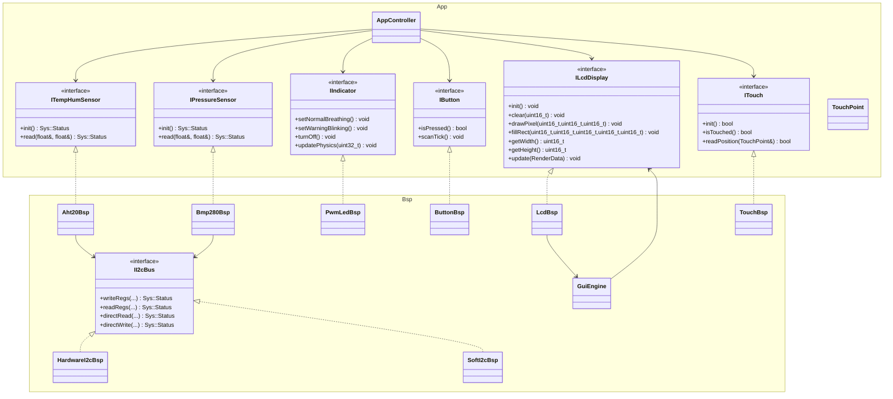

# MicroCPProjectSTM32 API 参考

本文档描述当前工程实际使用的抽象接口、关键实现类、核心数据结构和运行时对象装配方式。

当前事实源对应源码主要包括：

- `App/Inc/*`
- `BSP/Inc/*`
- `App/Src/app_entry.cpp`
- `App/Src/AppController.cpp`

如需先确认当前硬件映射，请先看 [Current_Integration_Status.md](./Current_Integration_Status.md)。
如需了解后续非阻塞调度和事件队列路线，请看 [Scheduling_Architecture.md](./Scheduling_Architecture.md)。

## 架构关系



## 系统级定义

`SYSTEM/sys.hpp` 维护工程的公共宏和枚举。当前文档中最常用的系统定义如下：

| 名称 | 说明 |
| :--- | :--- |
| `SYS_CPU_FREQ_HZ` | CPU 主频，当前为 `72 MHz` |
| `SYS_MAIN_LOOP_PERIOD_MS` | 历史兼容周期宏；当前主路径不再依赖固定 `HAL_Delay(100)` 主循环节流 |
| `SYS_I2C_ADDR_AHT20` | AHT20 设备地址，`0x38U` |
| `SYS_I2C_ADDR_BMP280` | BMP280 设备地址，`0x76U` |
| `Sys::Status` | 底层驱动与通信状态码 |
| `Sys::AlarmState` | `NORMAL`、`WARNING_TEMP`、`WARNING_PRES`、`MUTED` |

## App 层接口

### `ITempHumSensor`

文件：`App/Inc/ITempHumSensor.hpp`

- `Sys::Status init()`
- `Sys::Status read(float& temperature, float& humidity)`

当前实现：`Bsp::Aht20Bsp`

### `IPressureSensor`

文件：`App/Inc/IPressureSensor.hpp`

- `Sys::Status init()`
- `Sys::Status read(float& pressure, float& altitude)`

当前实现：`Bsp::Bmp280Bsp`

### `IIndicator`

文件：`App/Inc/IIndicator.hpp`

- `setNormalBreathing()`
- `setWarningBlinking()`
- `turnOff()`
- `updatePhysics(uint32_t elapsedMs)`

当前实现：`Bsp::PwmLedBsp`

### `IButton`

文件：`App/Inc/IButton.hpp`

- `bool isPressed()`
- `void scanTick()`

接口用于表达物理按键输入，当前工程已落地为页切换、确认和返回三个基础交互。

当前工程状态：

- 已绑定物理 `ButtonBsp`
- `app_entry.cpp` 中注入了 3 个真实按键：
  - `KEY_PAGE` (`PA2`, 对应底板 `S0`)
  - `KEY_CONFIRM` (`PA3`, 对应底板 `S2`)
  - `KEY_BACK` (`PA4`, 对应底板 `S3`)
- `scanTick()` 仍在 `App_Timer_10ms_ISR()` 中被调用，保持接口契约一致
- 当前 10ms 调度链路依赖 `SysTick_Handler()` 调用 `HAL_SYSTICK_IRQHandler()`

### `ITouch` 与 `TouchPoint`

文件：`App/Inc/ITouch.hpp`

`TouchPoint` 字段：

| 字段 | 类型 | 说明 |
| :--- | :--- | :--- |
| `x` | `uint16_t` | 屏幕 X 坐标 |
| `y` | `uint16_t` | 屏幕 Y 坐标 |
| `valid` | `bool` | 坐标是否有效 |

接口方法：

- `bool init()`
- `bool isTouched()`
- `bool readPosition(TouchPoint& point)`

当前实现：`Bsp::TouchBsp`

### `ILcdDisplay`

文件：`App/Inc/ILcdDisplay.hpp`

核心方法：

- `init()`
- `clear(uint16_t color)`
- `drawPixel(...)`
- `fillRect(...)`
- `getWidth() const`
- `getHeight() const`
- `update(const RenderData& data)`

`RenderData` 是 `AppController` 传给显示层的解耦数据包，包含：

| 类别 | 字段 |
| :--- | :--- |
| 实时数据 | `temperature` `humidity` `pressure` `altitude` |
| 阈值 | `tempHighLimit` `tempLowLimit` `pressHighLimit` `pressLowLimit` |
| 系统状态 | `alarmState` `currentViewPage` `isMuted` |
| 连接状态 | `tempHumConnected` `pressureConnected` |

当前实现：`Bsp::LcdBsp`

### `AppController`

文件：`App/Inc/AppController.hpp`

构造函数：

```cpp
AppController(ITempHumSensor& th,
              IPressureSensor& press,
              IIndicator& led,
              IButton& keyPage,
              IButton& keyConfirm,
              IButton& keyBack,
              ILcdDisplay& lcd,
              ITouch& touch);
```

当前职责：

- 初始化 LCD、温湿度传感器、气压传感器和指示灯
- 周期性采集温湿度、气压和海拔
- 根据阈值更新报警状态与指示灯模式
- 处理触摸翻页和 3 个物理按键输入
- 将遥测与状态打包为 `ILcdDisplay::RenderData`，交由显示层刷新

当前交互行为：

- `KEY_PAGE`：切换页面
- `KEY_CONFIRM`：确认/抑制当前告警展示
- `KEY_BACK`：返回默认页面，并在已确认状态下恢复告警展示
- 任意一次有效触摸释放均可切页

调度说明：

- `App_Loop()` 持续在主循环中执行，通过任务标志调度应用步骤
- `AppController::run()` 如保留，仅作为兼容入口；主路径拆分为传感器采样、输入处理、状态机更新和显示刷新等独立任务
- `App_Timer_10ms_ISR()` 只负责 10ms tick 分频、置任务标志和必要的轻量扫描
- `TOUCH_PEN` EXTI 回调只设置触摸待处理标志，由主循环下一个 tick 转为触摸事件
- 50ms 轮询保留为兜底，只用于补观测触摸按下/释放状态，不在 ISR 中读取坐标
- AHT20 运行期采样通过协作式状态机等待转换完成，不再用 `HAL_Delay(80)` 阻塞主循环

## BSP 层接口与实现

### `II2cBus`

文件：`BSP/Inc/II2cBus.hpp`

用于抽象 I2C 总线访问，方法包括：

- `writeRegs`
- `readRegs`
- `directRead`
- `directWrite`

这是 `Aht20Bsp` 和 `Bmp280Bsp` 共享的总线抽象。

### `HardwareI2cBsp`

文件：`BSP/Inc/HardwareI2cBsp.hpp`

构造函数：

```cpp
explicit HardwareI2cBsp(I2C_HandleTypeDef* hi2c);
```

说明：

- 当前默认总线实现
- 对应 `hi2c2`
- 通过 `HAL_I2C_*` API 完成寄存器读写与直接读写
- 当前真实引脚为 `PB10/PB11`

### `SoftI2cBsp`

文件：`BSP/Inc/SoftI2cBsp.hpp`

说明：

- 仍保留在仓库中，作为备选总线实现（近期已优化 SDA 引脚在推挽输出与内部上拉输入模式间的动态切换以提升稳定性）
- 当前不是运行路径
- 任何重新启用动作都必须同步修订当前状态文档和 `.ioc` 配置说明

### `Aht20Bsp`

文件：`BSP/Inc/Aht20Bsp.hpp`

说明：

- 依赖 `II2cBus`
- `init()` 负责状态读取与初始化命令
- `read()` 负责触发测量并换算温度、湿度

### `Bmp280Bsp`

文件：`BSP/Inc/Bmp280Bsp.hpp`

说明：

- 依赖 `II2cBus`
- `init()` 负责芯片 ID 检测、标定参数读取和工作模式设置
- `read()` 输出气压和推算海拔

### `PwmLedBsp`

文件：`BSP/Inc/PwmLedBsp.hpp`

说明：

- 当前由 `TIM3_CH3` 驱动
- 正常状态为呼吸灯
- 报警和已确认状态下保持高频闪烁警示

### `ButtonBsp`

文件：`BSP/Inc/ButtonBsp.hpp`

说明：

- 当前工程已实例化并注入 3 个物理按键
- 当前引脚为 `PA2` / `PA3` / `PA4`
- 按键按低电平视为有效按下，使用 20ms 消抖

### `LcdBsp`

文件：`BSP/Inc/LcdBsp.hpp`

说明：

- 当前使用 `SPI1`
- 当前接线按 `PB5 CS`、`PB7 DC`、`PB8 RST`、`PB6 LED`
- 负责 LCD 初始化、像素绘制、矩形填充、字符和浮点渲染（内置 `drawCenteredString` 与 `formatFloat` 辅助能力，用于规避 nano.specs 导致的 sprintf 浮点打印问题）
- 持有 `GuiEngine*`，通过 `setGui()` 注入
- `update(const RenderData&)` 根据 `currentViewPage` 渲染调试页面

### `GuiEngine`

文件：`BSP/Inc/GuiEngine.hpp`

说明：

- 依赖 `App::ILcdDisplay`
- 当前提供几何绘制原语：画线、画圆、画矩形边框、画三角形
- 不直接参与业务状态机，仅为显示层提供绘图辅助

### `TouchBsp`

文件：`BSP/Inc/TouchBsp.hpp`

说明：

- 实现 `App::ITouch`
- 负责触摸按下检测、原始采样、滤波和校准映射
- 当前引脚为 `PA8` / `PB4` / `PB3` / `PA1` / `PA0`
- `readPosition()` 包含 bit-bang 时序、延时和多次采样，因此即使启用 `TOUCH_PEN` 中断，也只允许在主循环或调度任务中读取坐标

## 当前对象装配

当前运行时对象在 `App/Src/app_entry.cpp` 中以静态对象形式创建。

```cpp
static Bsp::HardwareI2cBsp g_I2cBus(&hi2c2);
static Bsp::Aht20Bsp  g_Aht20(g_I2cBus);
static Bsp::Bmp280Bsp g_Bmp280(g_I2cBus);
static Bsp::PwmLedBsp g_LedIndicator(&htim3, TIM_CHANNEL_3);
static Bsp::ButtonBsp g_KeyPage(KEY_PAGE_GPIO_Port, KEY_PAGE_Pin);
static Bsp::ButtonBsp g_KeyConfirm(KEY_CONFIRM_GPIO_Port, KEY_CONFIRM_Pin);
static Bsp::ButtonBsp g_KeyBack(KEY_BACK_GPIO_Port, KEY_BACK_Pin);
static Bsp::LcdBsp g_Lcd(...);
static Bsp::TouchBsp g_Touch(...);
static Bsp::GuiEngine g_Gui(g_Lcd);
static App::AppController g_App(g_Aht20, g_Bmp280, g_LedIndicator,
                                g_KeyPage, g_KeyConfirm, g_KeyBack, g_Lcd, g_Touch);
```

初始化顺序：

1. `g_I2cBus.init()`
2. `g_Lcd.setGui(&g_Gui)`
3. `g_Touch.init()`
4. `g_App.setup()`

## 维护注意事项

- 若修改当前接线、DMA、I2C 或触摸路径，先同步 [Current_Integration_Status.md](./Current_Integration_Status.md)
- 若修改 `.ioc` 生成边界，先同步 [CubeMX_BSP_Boundary.md](./CubeMX_BSP_Boundary.md)
- 若修改主循环周期、`SysTick` 链路、任务标志或事件队列，先同步 [Scheduling_Architecture.md](./Scheduling_Architecture.md)
- 若只是研究替代方案，不要把研究文档中的描述误写成当前实现
