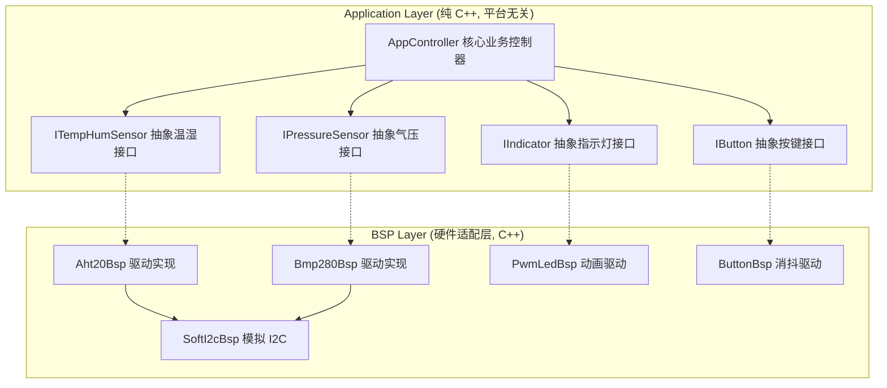

# STM32 C++ 固件库设计与开发参考文档 (MicroCPProjectSTM32 Docs)

本设计文档中心为 **MicroCPProjectSTM32** 项目提供核心的系统架构、底层驱动规范以及接口 API 参考。

本项目基于 **STM32F103** 平台，采用面向对象设计与 C++ 现代开发规范，构建了一套高度复用、松耦合的固件库体系，以支持底层驱动与上层应用逻辑的并行开发。

---

## 🗺️ 文档导航

| 文档名称 | 核心内容介绍 | 适用阶段 / 读者 |
| :--- | :--- | :--- |
| [📐 设计与开发规范](file:///home/yuki/Documents/Coding/Project-Micro/MicroCPProjectSTM32/Docs/Specification.md) | C++17 编译器优化配置、免 exceptions & RTTI 规范、目录职责、基于纯虚函数的控制反转（IoC）解耦机制。 | 基础规范 / 全体开发人员 |
| [🔌 API 接口与类参考手册](file:///home/yuki/Documents/Coding/Project-Micro/MicroCPProjectSTM32/Docs/API.md) | 系统全局状态、抽象传感器/外设接口定义、BSP 驱动类（模拟 I2C、AHT20、BMP280、PWM 呼吸灯、按键消抖）详细函数原型、遥测结构体以及 C 语言桥接包装指南。 | 编码实践 / 底层与 UI 开发者 |

---

## 🛠️ 系统软硬件配置概览

### 1. 物理引脚连接表 (Pinout)
| 外设模块 | 外设型号 | STM32 物理引脚 | 配置模式 | 物理作用与连接说明 |
| :--- | :--- | :--- | :--- | :--- |
| **复用 I2C 总线** | **AHT20 + BMP280** | **PB6 (SCL)**<br>**PB7 (SDA)** | 开漏输出 / 浮空输入 | **软件模拟 I2C 总线**。挂载 AHT20 (地址 `0x38`) 与 BMP280 (地址 `0x76`)，规避硬件 I2C 的潜在缺陷。 |
| **指示指示灯** | **高亮 LED** | **PA6 (TIM3_CH1)** | 复用推挽输出 | 输出高频 PWM（频率约 1kHz）驱动 LED。支持正常平滑呼吸与异常 5Hz 爆闪。 |
| **翻页按键 (KEY1)** | **轻触按键** | **PA0** | 上拉输入 | 检测按键按下，供主循环轮询触发 LCD 的数据显示切换。 |
| **静音按键 (KEY2)** | **轻触按键** | **PA1** | 上拉输入 | 检测按键按下，在系统报警时用于静音消音；非报警时可做恢复。 |

### 2. 软件运行参数 (sys.hpp)
*   **CPU 主频**：`72 MHz` (STM32F103 标称主频)
*   **主循环轮询频率**：`10 Hz`（主业务状态机轮询周期 `100 ms`）
*   **LED 动画采样步长**：`10 ms`（在定时器中断服务函数 `App_Timer_10ms_ISR` 中推进物理模拟）
*   **按键消抖时间**：`20 ms`（连续 2 个定时器中断扫描周期检测为低电平判定为有效触发）

---

## ⚙️ 核心架构思想：依赖倒置原则 (DIP)

本项目采用控制反转（IoC）与依赖注入（DI）模式，通过在应用层定义纯虚类接口实现业务逻辑与底层驱动的完全解耦。



### 职责与交互机制
*   **应用逻辑层 (App)**: 声明并依赖核心业务所需的抽象接口类（例如 `ITempHumSensor`, `IPressureSensor` 等）。
*   **板级支持包 (BSP)**: 继承并实现这些纯虚接口，负责底层的具体硬件物理操作。
*   **系统入口 (app_entry.cpp)**: 负责在系统初始化阶段以静态全局对象实例化具体实现类，并通过构造函数注入到 `AppController` 中。

---

## 🏗️ 快速开始：构建与编译说明

本项目采用 **CMake + Arm GCC** 构建链。您可以通过以下简单的步骤在本地进行编译构建：

### 编译先决条件
1. 安装 **GCC ARM Embedded Toolchain** (确保 `arm-none-eabi-gcc` 已经加入环境变量)。
2. 安装 **CMake** (v3.15 或以上) 和 **Make** 或 **Ninja** 构建工具。

### 构建步骤
打开终端并运行以下命令：

```bash
# 1. 创建并进入 build 构建目录
mkdir build && cd build

# 2. 生成 Makefile
cmake -DCMAKE_TOOLCHAIN_FILE=cmake/stm32_gcc.cmake ..

# 3. 编译生成固件 (支持 ELF, HEX, BIN 格式)
make -j4
```

或者使用 cmake 的标准构建命令：
```bash
cube-cmake --build PATH_TO_PROJECT/Debug --
```

> [!NOTE]
> 编译完成后，生成的固件位于 `build` 文件夹下，包含 `MicroCPProjectSTM32.elf`、`MicroCPProjectSTM32.hex` 以及 `MicroCPProjectSTM32.bin`，可以直接使用 ST-Link Utility、OpenOCD 或 J-Link 工具烧录至 STM32F103 硬件开发板上。

> [!IMPORTANT]
> **架构边界原则**：对具体外设或引脚的修改仅限在板级支持包（BSP）层；应用层（App）逻辑修改禁止引入任何硬件相关的 API 或底层 HAL 库头文件。
# 当前修订说明（2026-06）

- 当前工程的真实传感器总线为 `I2C2`（`PB10/PB11`），默认实现为 `HardwareI2cBsp`，不再以 `SoftI2cBsp` 作为运行时默认路径。
- `PA0/PA1` 已明确作为触摸输入 `TOUCH_PEN/TOUCH_DOUT` 使用，不再绑定物理 `ButtonBsp`。
- 维护时请优先阅读 `Current_Integration_Status.md` 与 `CubeMX_BSP_Boundary.md` 中的最新边界说明，再参考本 README 的历史架构描述。
