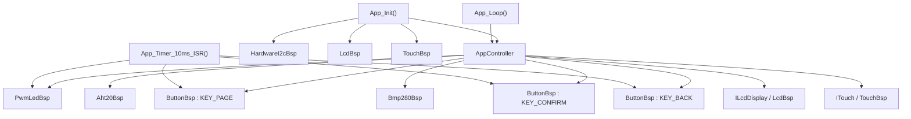

# MicroCPProjectSTM32 文档导航

本目录维护当前 STM32 固件工程的实现说明、接口文档、硬件边界和设计研究资料。

当前工程的事实基线以源码和 `MicroCPProjectSTM32.ioc` 为准。阅读文档时，建议优先按以下顺序：

1. [当前集成状态](./Current_Integration_Status.md)
2. [CubeMX 与 BSP 边界](./CubeMX_BSP_Boundary.md)
3. [API 接口参考](./API.md)
4. [调度架构方案对比与路线](./Scheduling_Architecture.md)
5. [设计与开发规范](./Specification.md)

## 当前工程摘要

- 当前运行链路：`AppController` -> `Aht20Bsp` / `Bmp280Bsp` / `LcdBsp` / `TouchBsp`
- 当前传感器总线：`HardwareI2cBsp` + `I2C2` (`PB10` / `PB11`)
- 当前显示链路：`SPI1` + `LcdBsp` + `GuiEngine`
- 当前状态灯：`PB0 / TIM3_CH3` 驱动物理状态 LED，正常呼吸、异常闪烁
- 当前输入模型：触摸屏 + 3 个物理按键；`PA0` / `PA1` 仍专用于触摸

## 文档清单

| 文档 | 作用 | 适合谁看 |
| :--- | :--- | :--- |
| [Current_Integration_Status.md](./Current_Integration_Status.md) | 当前可运行工程的硬件映射、输入模型、DMA/SWD 约束。 | 所有维护者 |
| [CubeMX_BSP_Boundary.md](./CubeMX_BSP_Boundary.md) | 约束哪些内容归 CubeMX，哪些内容归 BSP 和 App。 | 维护硬件初始化和驱动的开发者 |
| [API.md](./API.md) | 当前抽象接口、驱动实现、关键数据结构和对象装配方式。 | 编码人员 |
| [Scheduling_Architecture.md](./Scheduling_Architecture.md) | 对比 tick 标志表、纯中断事件驱动、中断 FIFO 队列，并给出推荐调度路线。 | 架构维护者 |
| [Specification.md](./Specification.md) | 目录职责、依赖倒置、编码和构建规范。 | 新加入项目的开发者 |
| [FPGA_LCD_Setup.md](./FPGA_LCD_Setup.md) | FPGA 透传接线与约束说明。非当前 MCU 代码实现文档。 | 联调硬件人员 |
| [Touch_GUI_Architecture.md](./Touch_GUI_Architecture.md) | 触摸 GUI 方向方案分析。 | GUI/交互预研 |

## 当前硬件映射

### 显示与触摸

| 功能 | 引脚 | 说明 |
| :--- | :--- | :--- |
| `SPI1_SCK` | `PA5` | LCD SPI 时钟 |
| `SPI1_MISO` | `PA6` | LCD 当前不读回数据，MISO 可保留 |
| `SPI1_MOSI` | `PA7` | LCD SPI 数据输出 |
| `LCD_LED` | `PB6` | 背光控制 |
| `LCD_DC` | `PB7` | 数据/命令选择 |
| `LCD_RST` | `PB8` | LCD 复位 |
| `LCD_CS` | `PB5` | LCD 片选 |
| `TOUCH_PEN` | `PA0` | 触摸按下检测 |
| `TOUCH_DOUT` | `PA1` | 触摸串行输出 |
| `TOUCH_TCLK` | `PA8` | 触摸时钟 |
| `TOUCH_TDIN` | `PB3` | 触摸串行输入 |
| `TOUCH_TCS` | `PB4` | 触摸片选 |

### 传感器与其他外设

| 功能 | 引脚 | 说明 |
| :--- | :--- | :--- |
| `I2C2_SCL` | `PB10` | AHT20 / BMP280 共用硬件 I2C |
| `I2C2_SDA` | `PB11` | AHT20 / BMP280 共用硬件 I2C |
| `TIM3_CH3` | `PB0` | `PwmLedBsp` 使用的 PWM 指示灯输出 |
| `KEY_PAGE` | `PA2` | 物理按键输入，对应底板 `S0` |
| `KEY_CONFIRM` | `PA3` | 物理按键输入，对应底板 `S2` |
| `KEY_BACK` | `PA4` | 物理按键输入，对应底板 `S3` |
| `USART1_TX/RX` | `PA9` / `PA10` | 调试日志串口 |

## 当前软件结构



## 项目路线图

### 已完成

- LCD 通过 `SPI1 + LcdBsp + GuiEngine` 完成基础显示和调试页面渲染
- 触摸屏通过 `TouchBsp` 完成按下检测、坐标采样、滤波和基础翻页
- AHT20 与 BMP280 通过 `HardwareI2cBsp + I2C2` 接入
- `PB0 / TIM3_CH3` 状态灯已接入，支持正常呼吸与异常闪烁
- `S0/S2/S3` 三个物理键已通过 FPGA 回送到 `PA2/PA3/PA4`
- `SysTick` 已恢复驱动 10ms 周期任务，按键扫描与 LED 动画可运行

### 当前短期目标

- 保持现有 `SysTick + App_Timer_10ms_ISR()` 链路稳定
- 继续通过串口 `SYS_LOG` 验证 LED、按键、触摸和传感器行为
- 清理临时调试日志，将必要日志收敛为可长期保留的健康状态输出
- 完成 `SysTick + 标志表` 非阻塞调度重构并保持上板行为稳定

### 中期重构目标

- 继续细化 `AppController` 任务拆分边界，保持 UI、输入和采样节奏清晰
- 评估是否需要进一步把 BMP280 或其他慢速外设改为更细粒度协作式步骤
- 评估 `TOUCH_PEN` EXTI，只在中断中置触摸事件标志，坐标读取仍保留在主循环

### 长期方向

- 根据交互复杂度决定是否引入固定容量事件 FIFO
- 建立更完整的触摸 UI 状态机，支持设置页、阈值调整和确认/返回交互
- 保持 STM32 与 FPGA 的引脚映射文档同步，避免固件、FPGA 约束和硬件手册分叉
- 完善上板验证流程，形成“烧录、串口检查、LED/按键/触摸回归”的固定测试清单

## 构建方式

工程当前使用 CMake Presets 和 `cmake/gcc-arm-none-eabi.cmake`。

```bash
cmake --preset Debug
cmake --build --preset Debug
```

如需发布构建：

```bash
cmake --preset Release
cmake --build --preset Release
```

默认输出目录为 `build/Debug` 或 `build/Release`，产物包含 `MicroCPProjectSTM32.elf` 以及 CubeMX 规则生成的镜像文件。

## 阅读约定

- 需要核对“当前工程到底怎么接、怎么跑”，先看 [Current_Integration_Status.md](./Current_Integration_Status.md)
- 需要修改 `.ioc`、GPIO、DMA 或外设初始化，先看 [CubeMX_BSP_Boundary.md](./CubeMX_BSP_Boundary.md)
- 需要接驱动或改 `AppController` 依赖，先看 [API.md](./API.md)
- 需要讨论主循环、触摸中断、事件队列或非阻塞调度，先看 [Scheduling_Architecture.md](./Scheduling_Architecture.md)
- 研究文档均不是当前实现说明；它们保留为备选方案或历史分析，使用前必须先对照当前状态文档
