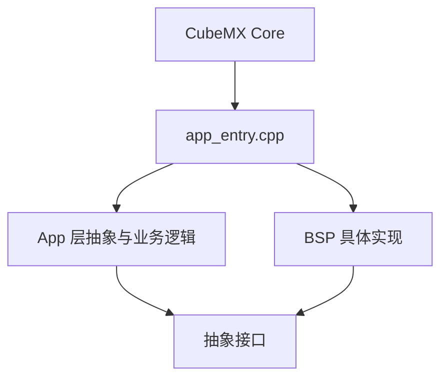

# MicroCPProjectSTM32 设计与开发规范

本文档描述工程的长期架构约束、目录职责、构建规范、CubeMX/BSP/App 边界和文档协作规则。

注意：

- 本文档是规范，不是当前接线说明。
- 当前实际硬件映射和运行路径以源码、`.ioc` 和 [Status.md](./Status.md) 为准。

## 构建规范

### 编译标准

- C 语言标准：`C11`
- C++ 标准：`C++17`
- 当前项目语言在 `CMakeLists.txt` 中统一配置

### C++ 约束

在 `GNU` 编译器路径下，当前工程启用了以下选项以降低固件体积：

- `-fno-exceptions`
- `-fno-rtti`
- `-fno-use-cxa-atexit`

规范要求：

- 禁止依赖异常处理作为控制流
- 禁止依赖 RTTI
- 优先使用静态对象、栈对象和显式状态码

### 推荐构建命令

```bash
cmake --preset Debug
cmake --build --preset Debug
```

发布构建：

```bash
cmake --preset Release
cmake --build --preset Release
```

## 目录职责

```text
MicroCPProjectSTM32/
├── App/        应用逻辑层，面向抽象接口编程
├── BSP/        板级支持包，负责硬件适配
├── Core/       CubeMX 生成的 MCU 初始化与中断骨架
├── Drivers/    HAL 与 CMSIS
├── SYSTEM/     系统级公共定义，仅保留 sys.hpp
├── Docs/       当前实现文档与维护规范
└── cmake/      工具链与 CubeMX 构建集成
```

### `App/`

- 只依赖抽象接口，不直接依赖具体硬件寄存器操作
- 不应在业务逻辑中混入 CubeMX 初始化代码
- `AppController` 是当前核心业务状态机

### `BSP/`

- 负责把 `App/` 所需接口映射到底层 HAL 或 GPIO 行为
- 可以包含 HAL 头文件
- 所有具体硬件时序、寄存器访问、总线适配都应收敛到这一层

### `Core/`

- 由 CubeMX 主导生成
- 负责时钟、GPIO、DMA、中断向量、外设句柄初始化
- 不承担业务逻辑

### `SYSTEM/`

- 只保留 `sys.hpp`
- 放置全局宏、公共枚举、系统级轻量工具

### `Docs/`

- `master/Docs` 只保留当前实现说明和协作规范
- 研究型、实验型、临时验证型资料不留在 `master/Docs`
- 文档如与代码冲突，以代码和 `.ioc` 为最终事实源

## 分层原则

工程遵循依赖倒置与依赖注入：

- `App` 定义能力需求，例如 `ITempHumSensor`、`IPressureSensor`、`ILcdDisplay`、`ITouch`
- `BSP` 提供能力实现，例如 `Aht20Bsp`、`Bmp280Bsp`、`LcdBsp`、`TouchBsp`
- `app_entry.cpp` 负责静态实例化并完成注入

### 推荐依赖方向



约束：

- `App` 可以依赖抽象接口和 `sys.hpp`
- `App` 不应直接依赖 HAL 句柄类型
- `BSP` 不应承担高层业务状态机
- `Core` 不应塞入业务策略

## CubeMX / BSP / App 边界

本项目采用“CubeMX 管配置、BSP 管行为、App 管业务”的边界约定。BSP 可以驱动引脚、访问设备，但不能再次配置已经在 `MicroCPProjectSTM32.ioc` 中声明过的 GPIO 模式、上下拉、速度、复用功能和外设时钟。

### 由 CubeMX 负责的配置

- LCD SPI 总线：`SPI1`，mode 0（`CPOL_LOW`、`CPHA_1EDGE`），分频 `/2`
- LCD 控制引脚：`PB5 LCD_CS`、`PB6 LCD_LED`、`PB7 LCD_DC`、`PB8 LCD_RST`
- 状态灯输出：`PB0 TIM3_CH3`
- 触摸 bit-bang 引脚：`PA8 TOUCH_TCLK`、`PB3 TOUCH_TDIN`、`PB4 TOUCH_TCS`
- 触摸输入引脚：`PA0 TOUCH_PEN`、`PA1 TOUCH_DOUT`
- 物理按键输入：`PA2 KEY_PAGE`、`PA3 KEY_CONFIRM`、`PA4 KEY_BACK`
- 传感器总线：`PB10/PB11` 为 `I2C2_SCL/I2C2_SDA`
- 调试口：保持 SWD-only
- 系统节拍：保留 `SysTick_Handler()` 到 `HAL_SYSTICK_Callback()` 的回调链

### 由 BSP 负责的行为

- `LcdBsp` 负责 ST7796S 的复位时序、命令/数据写入、地址窗口和调试页渲染
- `GuiEngine` 负责纯算法绘图原语
- `TouchBsp` 负责 XPT2046/ADS7846 的采样时序、滤波和校准计算
- `HardwareI2cBsp` 负责当前硬件 I2C2 总线访问映射
- BSP 的 `init()` 可以让设备进入默认空闲态或复位态，但不能再对 CubeMX 已拥有的引脚调用 `HAL_GPIO_Init()`

### 由 App 负责的行为

- `AppController` 负责输入消费、传感器采样调度、报警状态机、页面切换和健康日志
- `App_Loop()` 只在主循环上下文消费任务标志，不承担底层硬件重新配置

## 接口与状态码规范

- 抽象接口优先返回 `Sys::Status` 或显式布尔值，具体以接口头文件定义为准
- 文档示例中的接口签名必须与当前头文件保持一致
- 规范示例不能假设某个备选外设路径就是当前默认实现

特别说明：

- 当前工程里 `II2cBus` 是总线抽象，`HardwareI2cBsp` 是默认实现
- `SoftI2cBsp` 是备选实现，不应在规范文档中被描述为当前默认链路
- `IButton` 仍是业务抽象的一部分，当前工程运行时注入的是 3 个物理 `ButtonBsp`

## 生命周期与内存规范

- 避免运行时动态分配
- 优先使用静态生命周期对象
- 长驻驱动对象与应用对象应在系统初始化阶段创建完毕

这与当前工程一致：`app_entry.cpp` 中主要对象均为静态对象。

## CubeMX 协作规范

- `.ioc` 负责外设初始化、GPIO 模式、DMA、NVIC、时钟等底层配置
- 手写驱动逻辑放在 `BSP/`
- 业务逻辑放在 `App/`
- 每次重新生成代码后，都必须核对本文件与 [Status.md](./Status.md)

## 调度规范

- 当前软件节拍依赖 `SysTick_Handler()` 调用 `HAL_SYSTICK_IRQHandler()`，再由 `HAL_SYSTICK_Callback()` 调用 `App_Timer_10ms_ISR()`
- ISR 中只放轻量操作，例如计数、置位和轻量输入观察
- 不在 ISR 中执行触摸坐标读取、LCD 刷新、I2C 传感器事务或长时间日志输出
- 触摸释放事件在 ISR 中只置标志，业务动作仍留在主循环
- AHT20 运行期采样优先使用协作式非阻塞步骤，不使用主动等待式 `HAL_Delay`
- 周期任务默认使用 `tick + 标志表` 模式；若后续需要保序异步事件，再评估固定容量事件 FIFO

## App / ISR 边界提醒

- `App_Timer_10ms_ISR()` 只允许做计数、置位和轻量事件转发
- 不在 ISR 中调用 `readPosition()`、`LcdBsp::update()`、I2C 读写或 `SYS_LOG`
- 触摸释放中断只置待处理标志，页面切换在主循环中完成

## 重新生成代码后的核对清单

重新生成 CubeMX 代码后，应确认：

- `MX_GPIO_Init()` 将 `TOUCH_PEN_Pin` 配置为 `GPIO_MODE_IT_RISING + GPIO_PULLUP`
- `MX_GPIO_Init()` 将 `TOUCH_DOUT_Pin` 配置为 `GPIO_PULLUP`
- `MX_GPIO_Init()` 将 `KEY_PAGE_Pin|KEY_CONFIRM_Pin|KEY_BACK_Pin` 配置为 `GPIO_PULLUP`
- `MX_GPIO_Init()` 将 LCD/触摸输出引脚配置为 `GPIO_SPEED_FREQ_HIGH`，且默认电平正确
- `MX_SPI1_Init()` 保持 `SPI_POLARITY_LOW`、`SPI_PHASE_1EDGE`、`SPI_BAUDRATEPRESCALER_2`
- `MX_TIM3_Init()` 仍保留 `TIM3_CH3` 输出，供 `PwmLedBsp` 控制状态灯
- `MX_GPIO_Init()` 或其用户代码段仍保留 `__HAL_AFIO_REMAP_SWJ_NOJTAG()`，确保 `PB3/PB4` 可用于触摸
- `EXTI0_IRQn` 已启用，供 `TOUCH_PEN` 使用
- `SysTick_Handler()` 仍调用 `HAL_SYSTICK_IRQHandler()`
- BSP 文件没有重新配置已经由 `.ioc` 描述的 GPIO

## 文档维护规范

- “当前实现”类文档只能描述当前工程真实状态
- `Status.md` 负责当前事实、FPGA 透传/回送范围、系统节奏和系统核对项
- `API.md` 负责接口、对象装配和行为数据流
- `Specification.md` 负责长期规范和边界约束
- “研究/方案”类文档不保留在 `master/Docs`，必要时迁到专用分支，例如 `test_LCD`
- 涉及以下内容变更时，必须同步更新文档：
  - 接线和 GPIO 复用
  - `AppController` 的输入模型
  - 总线默认实现
  - 显示链路、调试日志和调试口约束
  - `SysTick` 链路、任务周期和 ISR 边界
  - FPGA 透传/回送范围
  - CMake 构建方式

## 不应再使用的过时假设

以下说法不应再出现在“当前实现”文档中：

- “默认传感器总线是 `SoftI2cBsp`”
- “`PA0/PA1` 绑定物理页切换/静音按键”
- “当前工程仍通过 `NullButton` 占位物理按键输入”
- “旧 toolchain 文件 `cmake/stm32_gcc.cmake` 是当前构建入口”
- “研究文档里的伪代码或方案对比可直接代表当前运行行为”
