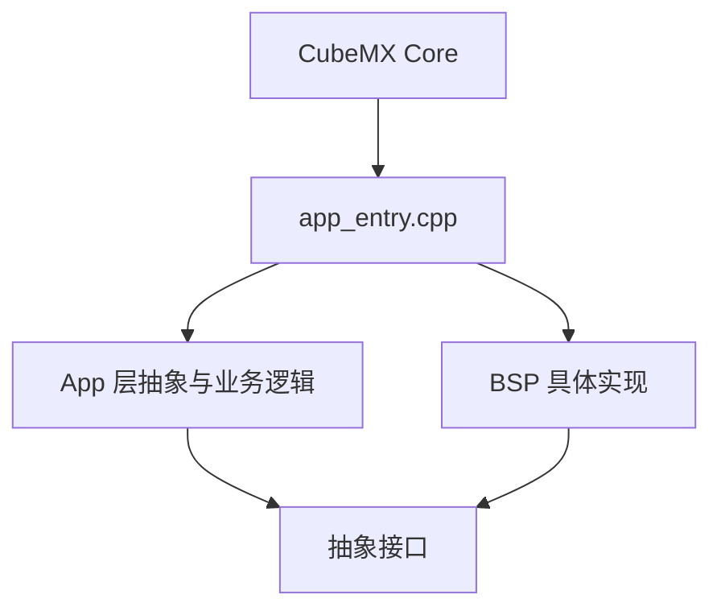

# MicroCPProjectSTM32 设计与开发规范

本文档描述工程的长期架构约束、目录职责、构建规范和协作规则。

注意：

- 本文档是规范，不是当前接线说明
- 当前实际硬件映射和运行路径以源码、`.ioc` 和 [Current_Integration_Status.md](./Current_Integration_Status.md) 为准

## 构建规范

### 编译标准

- C 语言标准：`C11`
- C++ 标准：`C++17`
- 当前项目语言在 `CMakeLists.txt` 中统一配置

### C++ 约束

在 `GNU` 编译器路径下，当前工程启用了以下选项以降低固件体积：

- `-fno-exceptions`
- `-fno-rtti`
- `-fno-use-cxa-atexit`

规范要求：

- 禁止依赖异常处理作为控制流
- 禁止依赖 RTTI
- 优先使用静态对象、栈对象和显式状态码

### 推荐构建命令

```bash
cmake --preset Debug
cmake --build --preset Debug
```

发布构建：

```bash
cmake --preset Release
cmake --build --preset Release
```

## 目录职责

```text
MicroCPProjectSTM32/
├── App/        应用逻辑层，面向抽象接口编程
├── BSP/        板级支持包，负责硬件适配
├── Core/       CubeMX 生成的 MCU 初始化与中断骨架
├── Drivers/    HAL 与 CMSIS
├── SYSTEM/     系统级公共定义，仅保留 sys.hpp
├── Docs/       项目文档与研究资料
└── cmake/      工具链与 CubeMX 构建集成
```

### `App/`

- 只依赖抽象接口，不直接依赖具体硬件寄存器操作
- 不应在业务逻辑中混入 CubeMX 初始化代码
- `AppController` 是当前核心业务状态机

### `BSP/`

- 负责把 `App/` 所需接口映射到底层 HAL 或 GPIO 行为
- 可以包含 HAL 头文件
- 所有具体硬件时序、寄存器访问、总线适配都应收敛到这一层

### `Core/`

- 由 CubeMX 主导生成
- 负责时钟、GPIO、DMA、中断向量、外设句柄初始化
- 不承担业务逻辑

### `SYSTEM/`

- 只保留 `sys.hpp`
- 放置全局宏、公共枚举、系统级轻量工具

### `Docs/`

- 当前实现说明与研究方案必须分开表达
- 文档如与代码冲突，以代码和 `.ioc` 为最终事实源

## 分层原则

工程遵循依赖倒置与依赖注入：

- `App` 定义能力需求，例如 `ITempHumSensor`、`IPressureSensor`、`ILcdDisplay`、`ITouch`
- `BSP` 提供能力实现，例如 `Aht20Bsp`、`Bmp280Bsp`、`LcdBsp`、`TouchBsp`
- `app_entry.cpp` 负责静态实例化并完成注入

### 推荐依赖方向



约束：

- `App` 可以依赖抽象接口和 `sys.hpp`
- `App` 不应直接依赖 HAL 句柄类型
- `BSP` 不应承担高层业务状态机
- `Core` 不应塞入业务策略

## 接口与状态码规范

- 抽象接口优先返回 `Sys::Status` 或显式布尔值，具体以接口头文件定义为准
- 规范示例不能假设某个具体外设就是当前默认路径
- 文档示例中出现的接口签名必须与当前头文件保持一致

特别说明：

- 当前工程里 `II2cBus` 是总线抽象，`HardwareI2cBsp` 是默认实现
- `SoftI2cBsp` 是备选实现，不应在规范文档中被描述为当前默认链路
- `IButton` 仍是业务抽象的一部分，但当前工程运行时注入的是 `NullButton`

## 生命周期与内存规范

- 避免运行时动态分配
- 优先使用静态生命周期对象
- 长驻驱动对象与应用对象应在系统初始化阶段创建完毕

这与当前工程一致：`app_entry.cpp` 中主要对象均为静态对象。

## CubeMX 协作规范

- `.ioc` 负责外设初始化、GPIO 模式、DMA、NVIC、时钟等底层配置
- 手写驱动逻辑放在 `BSP/`
- 业务逻辑放在 `App/`
- 每次重新生成代码后，都必须核对 [CubeMX_BSP_Boundary.md](./CubeMX_BSP_Boundary.md)

## 文档维护规范

- “当前实现”类文档只能描述当前工程真实状态
- “研究/方案”类文档必须在开头显式标注其非当前实现属性
- 涉及以下内容变更时，必须同步更新文档：
  - 接线和 GPIO 复用
  - `AppController` 的输入模型
  - 总线默认实现
  - 显示链路、DMA、中断和调试口约束
  - CMake 构建方式

## 不应再使用的过时假设

以下说法不应再出现在“当前实现”文档中：

- “默认传感器总线是 `SoftI2cBsp`”
- “`PA0/PA1` 绑定物理页切换/静音按键”
- “旧 toolchain 文件 `cmake/stm32_gcc.cmake` 是当前构建入口”
- “规范示例中的伪代码可直接代表当前接线或当前对象装配”
