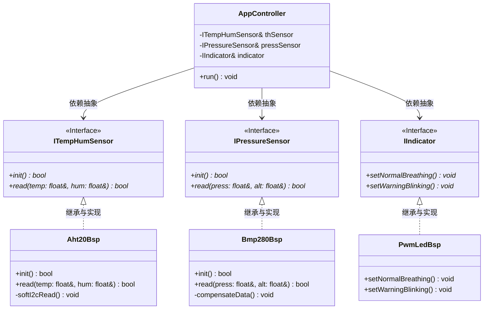

# STM32 C++ 项目设计与开发规范 (MicroCPProjectSTM32)

本项目致力于在 STM32F103 主控平台上，构建一套**高复用性、低耦合性、面向对象**的优质嵌入式系统固件。为了保证团队协作的高效性以及软件架构的优雅度，本规范确立了 C++ 开发标准、目录职责划分、系统宏定义管理以及基于虚函数的依赖注入解耦机制。

---

## 🛠️ 一、 编译环境与 C++ 支持规范

本项目基于 **CMake + GCC ARM Embedded** 链条进行构建，已全面支持现代化 C++ 编程标准。

### 1.1 C++ 编译器配置
*   **语言标准**：采用 **C++17**（`CMAKE_CXX_STANDARD 17`），允许使用折叠表达式、结构化绑定、`std::optional`、`constexpr if` 等高效特性。
*   **嵌入式代码体积优化**：由于 STM32F103C8T6 只有 64KB Flash / 20KB RAM，为防止 C++ 特性导致固件急剧膨胀，开启以下编译参数：
    *   `-fno-exceptions`：**禁用 C++ 异常处理**。异常处理会生成大量的 unwind 表，显著增加 Flash 开销。在嵌入式中，所有异常分支均应通过状态码（如 `enum class Result`）或 `std::optional` 传递。
    *   `-fno-rtti`：**禁用运行时类型识别 (RTTI)**。禁止使用 `dynamic_cast` 和 `typeid`，以消除运行时类描述信息的开销。使用静态多态（模板）或纯虚接口来代替。
    *   `-fno-use-cxa-atexit`：**禁用全局析构函数注册**。全局对象永远不会被销毁，这样可以节省析构链表的内存空间。

### 1.2 内存管理规范
*   **严禁运行时动态内存分配**：在 `while(1)` 业务循环中，严禁使用 `new` / `delete`、`malloc` / `free` 或包含隐式分配的 C++ 标准容器（如 `std::vector`），防止产生内存碎片导致系统运行数天后死机。
*   **静态生命周期**：所有的对象实例化（包括 BSP 驱动层和 App 应用层）应当在**系统初始化阶段**以静态全局对象、单例模式或栈上对象的形式创建完毕，并在生命周期内常驻内存。

---

## 📂 二、 目录结构与模块职责划分

项目目录结构清晰解耦，每一个文件夹都扮演着明确的架构角色。

```
MicroCPProjectSTM32/
├── App/                <-- 应用逻辑层 (纯 C++，完全平台无关)
│   ├── Inc/
│   └── Src/
├── BSP/                <-- 板级支持包 (软硬件适配器，C++ 实现)
│   ├── Inc/
│   └── Src/
├── Core/               <-- CubeMX 生成的核心代码 (C 语言，基本硬件初始化)
│   ├── Inc/
│   └── Src/
├── SYSTEM/             <-- 系统级全局宏定义目录 (仅含唯一头文件 sys.hpp)
│   └── sys.hpp
├── Drivers/            <-- ST 官方提供的 HAL 库与 CMSIS 驱动 (C 语言)
└── CMakeLists.txt      <-- 主构建文件
```

### 目录详细职责定义：
1.  **`SYSTEM/`（系统配置）**：
    *   **硬性约束**：**该文件夹有且仅能有一个头文件 `sys.hpp`。**
    *   **作用**：统一管理整个系统的核心常数、时钟宏定义、调试控制开关、以及全局公共工具。
2.  **`App/`（应用逻辑层）**：
    *   **硬性约束**：**绝对不允许 `#include "stm32f1xx_hal.h"`** 或任何硬件寄存器头文件。该层代码必须是纯粹的 C++ 逻辑。
    *   **作用**：定义整个系统的业务状态机、报警判定逻辑、温湿度与气压的交互逻辑。它通过**虚函数接口**来操纵硬件。
3.  **`BSP/`（板级支持包）**：
    *   **作用**：作为“适配器（Adapter）”，实现 `App/` 中定义的虚接口。这里可以包含 STM32 的 HAL 库头文件，编写软件 I2C 控制时序、PWM 寄存器操作以及具体的物理传感器通信协议。
4.  **`Core/` 与 `Drivers/`（底层基座）**：
    *   由 STM32CubeMX 工具维护，用于配置 MCU 时钟、底层引脚复用和串口中断等基座工作。

---

## 📐 三、 基于虚函数的“应用与驱动”解耦机制

为了解决嵌入式开发中“业务逻辑与底层驱动紧密耦合，一旦换传感器或改引脚就要重构整个项目”的痛点，本项目推行**控制反转 (IoC)** 与 **依赖倒置 (DIP)** 模式。

### 3.1 架构设计模式
*   **设计思路**：应用层 `App` 是“甲方”，它定义它需要什么样的数据（例如“我需要温度和湿度，我不在乎你是用 AHT20、SHT30 还是 DHT11 采集的”）。`App` 通过定义抽象类（纯虚函数接口）来表达需求。
*   板级支持包 `BSP` 是“乙方”，负责落实这些需求，继承并实现这些虚接口。
*   在系统初始化时，通过构造函数注入（Dependency Injection），将 `BSP` 实例作为指针或引用传递给 `App` 控制器。



### 3.2 抽象接口定义规范 (在 App 中声明)
在 `App` 目录下定义通用的抽象接口：

```cpp
// App/Inc/ITempHumSensor.hpp
#pragma once

namespace App {

class ITempHumSensor {
public:
    virtual ~ITempHumSensor() = default;
    
    // 初始化传感器，成功返回 true，失败返回 false
    virtual bool init() = 0;
    
    // 读取温湿度物理值
    virtual bool read(float& temperature, float& humidity) = 0;
};

} // namespace App
```

### 3.3 驱动层实现规范 (在 BSP 中实现)
在 `BSP` 目录下继承并具体实现接口：

```cpp
// BSP/Inc/Aht20Bsp.hpp
#pragma once
#include "ITempHumSensor.hpp"
#include "sys.hpp" // 可以包含系统宏或底层辅助方法

namespace Bsp {

class Aht20Bsp : public App::ITempHumSensor {
public:
    Aht20Bsp(uint16_t sclPin, uint16_t sdaPin);
    
    bool init() override;
    bool read(float& temperature, float& humidity) override;
    
private:
    uint16_t m_sclPin;
    uint16_t m_sdaPin;
    
    // 软件模拟 I2C 私有方法
    void I2C_Start();
    void I2C_Stop();
};

} // namespace Bsp
```

---

## ⚙️ 四、 `SYSTEM` 文件夹单一头文件策略

为了避免项目中充斥着各种凌乱的 `define.h`、`parameter.h`，本规范强制要求 `SYSTEM/` 文件夹下**有且仅能有唯一头文件 `sys.hpp`**。

### 4.1 `sys.hpp` 包含职责
1.  **系统基础常数**：主频（72MHz）、I2C 速率、主控制循环周期。
2.  **调试开关宏**：`SYS_DEBUG_MODE`，若开启，则启用串口日志输出，否则将其优化为空白。
3.  **公共状态代码**：定义系统的核心状态枚举。
4.  **轻量级内联工具**：如轻量级的临界区保护、原子延时等。

### 4.2 `sys.hpp` 代码模板示例
```cpp
// SYSTEM/sys.hpp
#pragma once

#include <stdint.h>

// 1. 系统底层参数定义
#define SYS_CPU_FREQ_HZ         72000000U
#define SYS_TICK_RATE_HZ        1000U
#define SYS_MAIN_LOOP_PERIOD_MS 100U

// 2. 调试输出开关
#define SYS_DEBUG_ENABLED       1

#if SYS_DEBUG_ENABLED
    #include <stdio.h>
    #define SYS_LOG(format, ...) printf("[SYS LOG] " format "\r\n", ##__VA_ARGS__)
#else
    #define SYS_LOG(format, ...) ((void)0)
#endif

// 3. 全局命名空间
namespace Sys {

// 系统通用错误代码
enum class Status : uint8_t {
    OK = 0,
    ERROR_INIT,
    ERROR_TIMEOUT,
    ERROR_BUSY,
    ERROR_OUT_OF_RANGE
};

// 全局安全关键区锁 (轻量级内联)
inline void EnterCritical() {
    __disable_irq();
}

inline void ExitCritical() {
    __enable_irq();
}

} // namespace Sys
```

---

## 📝 五、 C++ 代码书写与命名规范

为使项目固件呈现高端产品级品质，编码时需遵守以下风格：

1.  **命名空间保护**：
    *   所有应用逻辑位于 `namespace App`。
    *   所有硬件驱动和适配器位于 `namespace Bsp`。
    *   所有系统级宏与基础类型定义位于 `namespace Sys`。
2.  **类与接口命名**：
    *   抽象类/纯虚接口以大写 `I` 开头，采用驼峰命名法（如 `ISensor`, `IIndicator`）。
    *   具体实现类在 `BSP` 层，以技术/芯片名为前缀，以 `Bsp` 或 `Sensor` 结尾（如 `Aht20Bsp`, `PwmLedBsp`）。
3.  **成员变量命名**：
    *   类私有成员变量以 `m_` 开头（如 `m_temperature`）。
    *   静态常量以 `k` 开头且首字母大写（如 `const uint8_t kI2cAddress = 0x38;`）。
4.  **接口文件自包含**：
    *   所有头文件顶部必须使用 `#pragma once` 防止重复包含。
    *   尽量前置声明（Forward Declaration）其他类指针，只在 `.cpp` 文件中进行具体类的包含，以极大缩短项目的编译构建时间。
